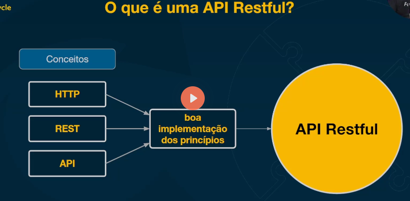

# REST e Níves de Maturidade

Conteúdo:

- 01 - Conceitos do REST
- 02 - Exemplo de uso "Freestyle" do REST
- 03 - Níveis de Maturidade do Richardson
- 04 - RMM - Level 1 - Recursos
- 05 - RMM - Level 2 - HTTP Verbs
- 06 - RMM - Level 3 - Hypermedia Controls
- 07 - Cache

### 5 princicípios do REST

- **Client-Server**: Separação de responsabilidades
- **Stateless**: Cada requisição deve conter todas as informações necessárias para ser processada
- **Cache**: Respostas devem ser explicitamente marcadas como cacheáveis ou não
- **Interface Uniforme**: Interface comum entre cliente e servidor
- **Sistema em camadas**: Cliente não precisa saber se está se comunicando com o servidor final ou intermediário

### REST vs SOAP vs GraphQL vs gRPC

- **REST**: Representational State Transfer
- **SOAP**: Simple Object Access Protocol
- **GraphQL**: Query language for APIs
- **gRPC**: Remote Procedure Call

obs: REST é um estilo de arquitetura, SOAP, GraphQL e gRPC são protocolos de comunicação

### O que é uma api restful?

- **API**: Application Programming Interface
- **RESTful**: API que segue os princípios do REST

## Exemplo REST meia boca para E-commerce 
    - (nem é REST pra falar a verdade, foje de muitos princípios) 

| Operação                                      | Método HTTP | Path                                           |
|-----------------------------------------------|-------------|------------------------------------------------|
| JWT login                                     | POST        | /jwt/login                                     |
| Session login                                 | POST        | /session/login                                 |
| Session logout                                | POST        | /session/logout                                |
| Create a customer                             | POST        | /customers/createCustomer                      |
| Get a customer by ID                          | GET         | /admin/customers/getCustomerById               |
| List customers with pagination                | GET         | /admin/customers/listCustomers                 |
| Update a customer                             | POST        | /admin/customers/updateCustomer                |
| Delete a customer                             | POST        | /admin/customers/deleteCustomer                |
| Create a category                             | POST        | /admin/categories/createCategory               |
| Get a category by slug                        | GET         | /categories/getCategoryBySlug                  |
| List categories with pagination               | GET         | /categories/listCategories                     |
| List categories in admin with pagination      | GET         | /admin/categories/listCategories               |
| Update a category                             | POST        | /admin/categories/updateCategory               |
| Delete a category                             | POST        | /admin/categories/deleteCategory               |
| Create a product                              | POST        | /admin/products/createProduct                  |
| Get a product by ID                           | GET         | /admin/products/getProductById                 |
| Get a product by slug                         | GET         | /products/getProductBySlug                     |
| Update a product                              | POST        | /admin/products/updateProduct                  |
| Delete a product                              | POST        | /admin/products/deleteProduct                  |
| List products with pagination                 | GET         | /products/listProducts                         |
| List products in admin with pagination        | GET         | /admin/products/listProducts                   |
| Get CSV of products                           | GET         | /admin/products/listProducts.csv               |
| Add an item to the cart                       | POST        | /carts/addItemToCart                           |
| Get a cart by ID                              | GET         | /carts/getCart                                 |
| Remove an item from the cart                  | POST        | /carts/removeItemFromCart                      |
| Clear the cart                                | POST        | /carts/clearCart                               |
| Create an order                               | POST        | /orders/createOrder                            |
| List orders with pagination                   | GET         | /orders/listOrders                             |

---